<!-- PROFILE_README_VERSION: v1.2.1 -->
<!-- PROFILE_README_OWNER: Thugger069 / 🜂 Lysergic -->
<!-- PROFILE_README_SPEC: QuantumProfileSurface/v1 -->
<!-- PROFILE_README_LOCKS: header,principles -->

<!-- qp:section:header:start -->
# 𖢧ꛅ𖤢ꚽꚳꛈ𖢧ꛕꛅ · 🜂 Lysergic

**Quantum Systems Architect & AI Maximalist**  
Auditable, reversible AI systems · automation stacks · security-flavored DevOps.

`◇ Auditable AI` `◎ Operator Stacks` `● Shadow Ops & DevOps`

<!-- qp:meta:start -->
Last updated: 2025-11-07 · Current focus: QPS/v1 surface & Smooth Operator stack.
<!-- qp:meta:end -->
<!-- qp:section:header:end -->

<!-- qp:section:hud:start -->
### Quantum HUD / Signal Grid

- AI systems · multi-agent orchestration · auditable & reversible pipelines  
- iOS automation · Shortcuts · Scriptable · Obsidian · Termius · local-first ops  
- Security research · DNS meshes · proxy lattices · MITM instrumentation  
- 3D commerce · devtools automation · security-flavored DevOps enablement  
- Current vectors → ship Smooth Operator beta webhooks · orchestrate Quantum Autopilot rituals · expand shadow-scripts stealth lab

  
Telemetry Snapshot

    
  

<!-- qp:section:hud:end -->

<!-- qp:section:projects:start -->
### Now Shipping Vessels

- **shadow-scripts** · `ship`  
  Security-research automation lab for rotating proxy meshes, MITM loaders, DNS overlays, and stealthful traffic rehearsal.  
  Stack: Shortcuts · Scriptable · Node.js · WireGuard · Loon · Shadowrocket — [TODO: link]

- **Smooth Operator** · `beta`  
  Siri-triggered reply engine that turns DMs into deterministic flows with JSON state, handoff queues, and compliance receipts.  
  Stack: Shortcuts · Scriptable · Supabase · Cloudflare Workers — [TODO: link]

- **Quantum Autopilot** · `ship`  
  Local-first ritual matrix orchestrating morning / ship / focus routines across iOS, macOS, and GitHub automations.  
  Stack: Shortcuts · Pushcut · GitHub Actions · Notion API — [TODO: link]

- **CryptoVault** · `alpha`  
  Zero-knowledge flavored asset vault with reversible ledger snapshots and programmable mitigation triggers.  
  Stack: Next.js · TypeScript · Prisma · PlanetScale · ZK toolkit — [TODO: link]

- **Brand Terminal** · `ship`  
  Neon-glass profile surfaces for SaaS & devtools teams, wiring real-time telemetry into presentation-grade terminals.  
  Stack: React Three Fiber · Tailwind · Sanity · Vercel Edge — [TODO: link]

- **Borderless-Pay** · `beta`  
  Cross-border payout mesh layering compliance rules, tokenized invoices, and auditable FX routing.  
  Stack: Fastify · TypeScript · Temporal · Stripe Atlas — [TODO: link]
<!-- qp:section:projects:end -->

<!-- qp:section:stacks:start -->
### Stacks & Surfaces Matrix

- **Core Web Stack** – Next.js · Fastify · TypeScript · Prisma · PostgreSQL · Tailwind · React Three Fiber  
- **Automation Stack** – iOS Shortcuts · Scriptable · Obsidian · Termius · Working Copy  
- **Security / Networking** – Shadowrocket · Loon · WireGuard · custom DNS profiles

<!-- qp:section:stacks:end -->

<!-- qp:section:workflows:start -->
### Quantum Workflows

- **Smooth Operator** — Siri-triggered reply engine for social DMs powered by Shortcuts + Scriptable + JSON state.  
- **Quantum Autopilot** — local-first routines (morning, ship, focus) orchestrated on iOS 18 with GitHub telemetry.  
- **shadow-scripts** — security-research lab for proxy configs, MITM loaders, DNS stacks, and stealth profiles.  
- **Resonant Deploy** — reversible GitHub Actions pipeline with observability hooks and temporal rollbacks baked in.  
- **Glassroom QA** — XR-ready UX reviews blending React Three Fiber surfaces with security regression probes.
<!-- qp:section:workflows:end -->

<!-- qp:section:principles:start -->
### Operating Tenets

- Ship fast · Scale forever · Break nothing.  
- Everything is auditable, reversible, and automatable.  
- Signal over noise – no dead surfaces.  
- Local-first where it matters, cloud when it compounds.  
- Design for observability, not guesswork.
<!-- qp:section:principles:end -->

<!-- qp:section:contact:start -->
### Orbit & Uplink

> ╭─ **Quantum Uplink Console** ─╮  
> │ 🛰 GitHub → [`@Thugger069`](https://github.com/Thugger069) │  
> │ ✉ DM     → [X (Twitter)](https://x.com/<your_handle>)     │  
> │ 📓 Lab    → [Quantum Lab](https://github.com/Thugger069/quantum-lab) │  
> ╰─ Send: context · constraints · ideal outcome ─╯  

I design and ship auditable, reversible AI systems and automation stacks — from iOS operators to full-stack devops and “shadow” tooling.

  
<strong>Engage the operator</strong>

  - Architect AI + automation systems with real paper trails: logs, traces, and state you can reason about.  
  - Design operator stacks across iOS, desktop, and cloud — Shortcuts, Scriptable, CLIs, daemons, and glue that actually talk.  
  - Harden pipelines, DNS/proxy setups, and “shadow” infrastructure so it’s powerful but still accountable and rollback-safe.  
  - Turn vague product ideas into concrete, shippable technical surfaces with clear interfaces and next steps.  

<!-- qp:section:contact:end -->

---
<!-- qp:changelog:start -->
### Quantum Profile Changelog

- v1.2.1 — Streamlined header with text surface + quantum shell terminal, updated focus meta.
- v1.2.0 — Evolved header with mission console, blueprint snapshot, and quantum shell caption.
- v1.1.0 — Animated terminal hero, curated telemetry snapshot, HUD refinement.
- v1.0.0 — Initial quantum profile surface by Cursor agent.
<!-- qp:changelog:end -->

<!-- Profile README managed by QuantumProfileSurface/v1. -->
<!-- Profile README v1.2.1 by Cursor agent: quantum theme, modular sections, QPS/v1-compliant. -->
