  

  

<pre class="terminal">
Last login: 2025-10-12 03:56:32 UTC on ttys000
𖢧ꛅ𖤢 ꚽꚳꛈ𖢧ꛕꛅ@github ~ % uptime
  03:56 up 2:51, 1 user, load averages: 0.56 0.62 0.48

𖢧ꛅ𖤢 ꚽꚳꛈ𖢧ꛕꛅ@github ~ % ls -la Projects/
total 40
drwxr-xr-x  8 𖢧ꛅ𖤢 ꚽꚳꛈ𖢧ꛕꛅ  staff  256 May 07 02:51 .
drwxr-xr-x  5 𖢧ꛅ𖤢 ꚽꚳꛈ𖢧ꛕꛅ  staff  160 May 07 02:51 ..
drwxr-xr-x  7 𖢧ꛅ𖤢 ꚽꚳꛈ𖢧ꛕꛅ  staff  224 DevOps
drwxr-xr-x  6 𖢧ꛅ𖤢 ꚽꚳꛈ𖢧ꛕꛅ  staff  192 OpenSource
drwxr-xr-x  5 𖢧ꛅ𖤢 ꚽꚳꛈ𖢧ꛕꛅ  staff  160 Scripts
-rw-r--r--  1 𖢧ꛅ𖤢 ꚽꚳꛈ𖢧ꛕꛅ  staff  925 TODO.md

𖢧ꛅ𖤢 ꚽꚳꛈ𖢧ꛕꛅ@github ~ % cat Projects/TODO.md
# ℭ𝔲𝔯𝔯𝔢𝔫𝔱 𝔓𝔯𝔬𝔧𝔢𝔠𝔱𝔰 📋

→ Automating deployment workflows
→ Contributing to open source
→ Learning Kubernetes
→ Building shell script utilities
</pre>

  

<!-- START SNAKE -->
<picture>
  <source media="(prefers-color-scheme: dark)" srcset="dist/github-snake-dark.svg?ts=2025-10-12 03%3A56%3A32 UTC" />
  <source media="(prefers-color-scheme: light)" srcset="dist/github-snake.svg?ts=2025-10-12 03%3A56%3A32 UTC" />
  
</picture>
<!-- END SNAKE -->

  Last Updated: 2025-10-12 03:56:32 UTC

🧿 Automated daily update via <code>update_readme.sh</code> • 🧬 Maintained by 𖢧ꛅ𖤢 ꚽꚳꛈ𖢧ꛕꛅ

  

