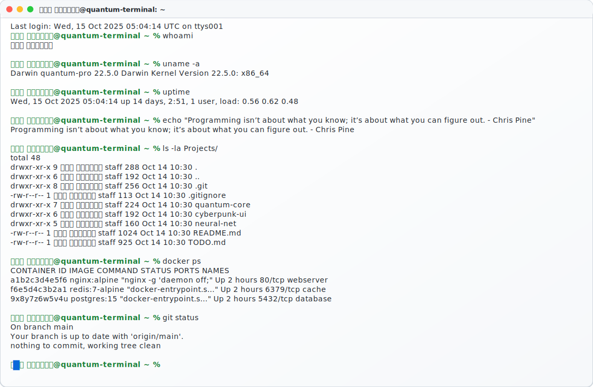

<!-- Quantum Cyberpunk Header -->

  

<!-- Header End -->

<!-- Quantum Cyberpunk Header Start -->

  <!-- Animated Border -->
  

  
  <svg width="100%" height="100%" style="position:absolute;top:0;left:0;z-index:0;opacity:0.4;">
    <text x="0.00%" y="-10%" fill="#00ff41" font-family="monospace" font-size="0.7rem" font-weight="bold">
      <tspan x="0.00%" dy="1.2em" opacity="0">
        1
        <animate attributeName="opacity" values="0;0.8;0" dur="4.09s" begin="0.00s" repeatCount="indefinite"/>
      </tspan><tspan x="0.00%" dy="1.2em" opacity="0">
        ス
        <animate attributeName="opacity" values="0;0.8;0" dur="4.09s" begin="0.20s" repeatCount="indefinite"/>
      </tspan><tspan x="0.00%" dy="1.2em" opacity="0">
        ソ
        <animate attributeName="opacity" values="0;0.8;0" dur="4.09s" begin="0.40s" repeatCount="indefinite"/>
      </tspan><tspan x="0.00%" dy="1.2em" opacity="0">
        セ
        <animate attributeName="opacity" values="0;0.8;0" dur="4.09s" begin="0.60s" repeatCount="indefinite"/>
      </tspan>
      <animate attributeName="y" values="-10%;110%" dur="4.09s" repeatCount="indefinite" begin="2.96s"/>
    </text><text x="2.50%" y="-10%" fill="#00ff41" font-family="monospace" font-size="0.7rem" font-weight="bold">
      <tspan x="2.50%" dy="1.2em" opacity="0">
        セ
        <animate attributeName="opacity" values="0;0.8;0" dur="4.62s" begin="0.00s" repeatCount="indefinite"/>
      </tspan><tspan x="2.50%" dy="1.2em" opacity="0">
        ソ
        <animate attributeName="opacity" values="0;0.8;0" dur="4.62s" begin="0.20s" repeatCount="indefinite"/>
      </tspan><tspan x="2.50%" dy="1.2em" opacity="0">
        チ
        <animate attributeName="opacity" values="0;0.8;0" dur="4.62s" begin="0.40s" repeatCount="indefinite"/>
      </tspan><tspan x="2.50%" dy="1.2em" opacity="0">
        キ
        <animate attributeName="opacity" values="0;0.8;0" dur="4.62s" begin="0.60s" repeatCount="indefinite"/>
      </tspan>
      <animate attributeName="y" values="-10%;110%" dur="4.62s" repeatCount="indefinite" begin="1.84s"/>
    </text><text x="5.00%" y="-10%" fill="#00ff41" font-family="monospace" font-size="0.7rem" font-weight="bold">
      <tspan x="5.00%" dy="1.2em" opacity="0">
        テ
        <animate attributeName="opacity" values="0;0.8;0" dur="3.90s" begin="0.00s" repeatCount="indefinite"/>
      </tspan><tspan x="5.00%" dy="1.2em" opacity="0">
        0
        <animate attributeName="opacity" values="0;0.8;0" dur="3.90s" begin="0.20s" repeatCount="indefinite"/>
      </tspan>
      <animate attributeName="y" values="-10%;110%" dur="3.90s" repeatCount="indefinite" begin="0.85s"/>
    </text><text x="7.50%" y="-10%" fill="#00ff41" font-family="monospace" font-size="0.7rem" font-weight="bold">
      <tspan x="7.50%" dy="1.2em" opacity="0">
        チ
        <animate attributeName="opacity" values="0;0.8;0" dur="3.65s" begin="0.00s" repeatCount="indefinite"/>
      </tspan><tspan x="7.50%" dy="1.2em" opacity="0">
        0
        <animate attributeName="opacity" values="0;0.8;0" dur="3.65s" begin="0.20s" repeatCount="indefinite"/>
      </tspan><tspan x="7.50%" dy="1.2em" opacity="0">
        セ
        <animate attributeName="opacity" values="0;0.8;0" dur="3.65s" begin="0.40s" repeatCount="indefinite"/>
      </tspan><tspan x="7.50%" dy="1.2em" opacity="0">
        ウ
        <animate attributeName="opacity" values="0;0.8;0" dur="3.65s" begin="0.60s" repeatCount="indefinite"/>
      </tspan>
      <animate attributeName="y" values="-10%;110%" dur="3.65s" repeatCount="indefinite" begin="0.98s"/>
    </text><text x="10.00%" y="-10%" fill="#00ff41" font-family="monospace" font-size="0.7rem" font-weight="bold">
      <tspan x="10.00%" dy="1.2em" opacity="0">
        キ
        <animate attributeName="opacity" values="0;0.8;0" dur="3.02s" begin="0.00s" repeatCount="indefinite"/>
      </tspan><tspan x="10.00%" dy="1.2em" opacity="0">
        ク
        <animate attributeName="opacity" values="0;0.8;0" dur="3.02s" begin="0.20s" repeatCount="indefinite"/>
      </tspan>
      <animate attributeName="y" values="-10%;110%" dur="3.02s" repeatCount="indefinite" begin="1.55s"/>
    </text><text x="12.50%" y="-10%" fill="#00ff41" font-family="monospace" font-size="0.7rem" font-weight="bold">
      <tspan x="12.50%" dy="1.2em" opacity="0">
        オ
        <animate attributeName="opacity" values="0;0.8;0" dur="4.39s" begin="0.00s" repeatCount="indefinite"/>
      </tspan><tspan x="12.50%" dy="1.2em" opacity="0">
        ク
        <animate attributeName="opacity" values="0;0.8;0" dur="4.39s" begin="0.20s" repeatCount="indefinite"/>
      </tspan><tspan x="12.50%" dy="1.2em" opacity="0">
        セ
        <animate attributeName="opacity" values="0;0.8;0" dur="4.39s" begin="0.40s" repeatCount="indefinite"/>
      </tspan>
      <animate attributeName="y" values="-10%;110%" dur="4.39s" repeatCount="indefinite" begin="0.71s"/>
    </text><text x="15.00%" y="-10%" fill="#00ff41" font-family="monospace" font-size="0.7rem" font-weight="bold">
      <tspan x="15.00%" dy="1.2em" opacity="0">
        イ
        <animate attributeName="opacity" values="0;0.8;0" dur="3.39s" begin="0.00s" repeatCount="indefinite"/>
      </tspan><tspan x="15.00%" dy="1.2em" opacity="0">
        カ
        <animate attributeName="opacity" values="0;0.8;0" dur="3.39s" begin="0.20s" repeatCount="indefinite"/>
      </tspan><tspan x="15.00%" dy="1.2em" opacity="0">
        タ
        <animate attributeName="opacity" values="0;0.8;0" dur="3.39s" begin="0.40s" repeatCount="indefinite"/>
      </tspan><tspan x="15.00%" dy="1.2em" opacity="0">
        ツ
        <animate attributeName="opacity" values="0;0.8;0" dur="3.39s" begin="0.60s" repeatCount="indefinite"/>
      </tspan>
      <animate attributeName="y" values="-10%;110%" dur="3.39s" repeatCount="indefinite" begin="0.86s"/>
    </text><text x="17.50%" y="-10%" fill="#00ff41" font-family="monospace" font-size="0.7rem" font-weight="bold">
      <tspan x="17.50%" dy="1.2em" opacity="0">
        コ
        <animate attributeName="opacity" values="0;0.8;0" dur="4.13s" begin="0.00s" repeatCount="indefinite"/>
      </tspan><tspan x="17.50%" dy="1.2em" opacity="0">
        イ
        <animate attributeName="opacity" values="0;0.8;0" dur="4.13s" begin="0.20s" repeatCount="indefinite"/>
      </tspan>
      <animate attributeName="y" values="-10%;110%" dur="4.13s" repeatCount="indefinite" begin="0.96s"/>
    </text><text x="20.00%" y="-10%" fill="#00ff41" font-family="monospace" font-size="0.7rem" font-weight="bold">
      <tspan x="20.00%" dy="1.2em" opacity="0">
        1
        <animate attributeName="opacity" values="0;0.8;0" dur="4.86s" begin="0.00s" repeatCount="indefinite"/>
      </tspan><tspan x="20.00%" dy="1.2em" opacity="0">
        ウ
        <animate attributeName="opacity" values="0;0.8;0" dur="4.86s" begin="0.20s" repeatCount="indefinite"/>
      </tspan><tspan x="20.00%" dy="1.2em" opacity="0">
        キ
        <animate attributeName="opacity" values="0;0.8;0" dur="4.86s" begin="0.40s" repeatCount="indefinite"/>
      </tspan><tspan x="20.00%" dy="1.2em" opacity="0">
        テ
        <animate attributeName="opacity" values="0;0.8;0" dur="4.86s" begin="0.60s" repeatCount="indefinite"/>
      </tspan>
      <animate attributeName="y" values="-10%;110%" dur="4.86s" repeatCount="indefinite" begin="1.57s"/>
    </text><text x="22.50%" y="-10%" fill="#00ff41" font-family="monospace" font-size="0.7rem" font-weight="bold">
      <tspan x="22.50%" dy="1.2em" opacity="0">
        ク
        <animate attributeName="opacity" values="0;0.8;0" dur="4.56s" begin="0.00s" repeatCount="indefinite"/>
      </tspan><tspan x="22.50%" dy="1.2em" opacity="0">
        オ
        <animate attributeName="opacity" values="0;0.8;0" dur="4.56s" begin="0.20s" repeatCount="indefinite"/>
      </tspan>
      <animate attributeName="y" values="-10%;110%" dur="4.56s" repeatCount="indefinite" begin="2.53s"/>
    </text><text x="25.00%" y="-10%" fill="#00ff41" font-family="monospace" font-size="0.7rem" font-weight="bold">
      <tspan x="25.00%" dy="1.2em" opacity="0">
        ツ
        <animate attributeName="opacity" values="0;0.8;0" dur="3.64s" begin="0.00s" repeatCount="indefinite"/>
      </tspan><tspan x="25.00%" dy="1.2em" opacity="0">
        ツ
        <animate attributeName="opacity" values="0;0.8;0" dur="3.64s" begin="0.20s" repeatCount="indefinite"/>
      </tspan><tspan x="25.00%" dy="1.2em" opacity="0">
        イ
        <animate attributeName="opacity" values="0;0.8;0" dur="3.64s" begin="0.40s" repeatCount="indefinite"/>
      </tspan>
      <animate attributeName="y" values="-10%;110%" dur="3.64s" repeatCount="indefinite" begin="1.95s"/>
    </text><text x="27.50%" y="-10%" fill="#00ff41" font-family="monospace" font-size="0.7rem" font-weight="bold">
      <tspan x="27.50%" dy="1.2em" opacity="0">
        エ
        <animate attributeName="opacity" values="0;0.8;0" dur="4.72s" begin="0.00s" repeatCount="indefinite"/>
      </tspan><tspan x="27.50%" dy="1.2em" opacity="0">
        1
        <animate attributeName="opacity" values="0;0.8;0" dur="4.72s" begin="0.20s" repeatCount="indefinite"/>
      </tspan>
      <animate attributeName="y" values="-10%;110%" dur="4.72s" repeatCount="indefinite" begin="2.62s"/>
    </text><text x="30.00%" y="-10%" fill="#00ff41" font-family="monospace" font-size="0.7rem" font-weight="bold">
      <tspan x="30.00%" dy="1.2em" opacity="0">
        ツ
        <animate attributeName="opacity" values="0;0.8;0" dur="4.02s" begin="0.00s" repeatCount="indefinite"/>
      </tspan><tspan x="30.00%" dy="1.2em" opacity="0">
        セ
        <animate attributeName="opacity" values="0;0.8;0" dur="4.02s" begin="0.20s" repeatCount="indefinite"/>
      </tspan><tspan x="30.00%" dy="1.2em" opacity="0">
        ケ
        <animate attributeName="opacity" values="0;0.8;0" dur="4.02s" begin="0.40s" repeatCount="indefinite"/>
      </tspan>
      <animate attributeName="y" values="-10%;110%" dur="4.02s" repeatCount="indefinite" begin="2.55s"/>
    </text><text x="32.50%" y="-10%" fill="#00ff41" font-family="monospace" font-size="0.7rem" font-weight="bold">
      <tspan x="32.50%" dy="1.2em" opacity="0">
        コ
        <animate attributeName="opacity" values="0;0.8;0" dur="4.89s" begin="0.00s" repeatCount="indefinite"/>
      </tspan><tspan x="32.50%" dy="1.2em" opacity="0">
        ク
        <animate attributeName="opacity" values="0;0.8;0" dur="4.89s" begin="0.20s" repeatCount="indefinite"/>
      </tspan><tspan x="32.50%" dy="1.2em" opacity="0">
        セ
        <animate attributeName="opacity" values="0;0.8;0" dur="4.89s" begin="0.40s" repeatCount="indefinite"/>
      </tspan><tspan x="32.50%" dy="1.2em" opacity="0">
        エ
        <animate attributeName="opacity" values="0;0.8;0" dur="4.89s" begin="0.60s" repeatCount="indefinite"/>
      </tspan>
      <animate attributeName="y" values="-10%;110%" dur="4.89s" repeatCount="indefinite" begin="0.49s"/>
    </text><text x="35.00%" y="-10%" fill="#00ff41" font-family="monospace" font-size="0.7rem" font-weight="bold">
      <tspan x="35.00%" dy="1.2em" opacity="0">
        0
        <animate attributeName="opacity" values="0;0.8;0" dur="3.64s" begin="0.00s" repeatCount="indefinite"/>
      </tspan><tspan x="35.00%" dy="1.2em" opacity="0">
        シ
        <animate attributeName="opacity" values="0;0.8;0" dur="3.64s" begin="0.20s" repeatCount="indefinite"/>
      </tspan><tspan x="35.00%" dy="1.2em" opacity="0">
        ク
        <animate attributeName="opacity" values="0;0.8;0" dur="3.64s" begin="0.40s" repeatCount="indefinite"/>
      </tspan>
      <animate attributeName="y" values="-10%;110%" dur="3.64s" repeatCount="indefinite" begin="2.22s"/>
    </text><text x="37.50%" y="-10%" fill="#00ff41" font-family="monospace" font-size="0.7rem" font-weight="bold">
      <tspan x="37.50%" dy="1.2em" opacity="0">
        ツ
        <animate attributeName="opacity" values="0;0.8;0" dur="3.79s" begin="0.00s" repeatCount="indefinite"/>
      </tspan><tspan x="37.50%" dy="1.2em" opacity="0">
        テ
        <animate attributeName="opacity" values="0;0.8;0" dur="3.79s" begin="0.20s" repeatCount="indefinite"/>
      </tspan><tspan x="37.50%" dy="1.2em" opacity="0">
        ク
        <animate attributeName="opacity" values="0;0.8;0" dur="3.79s" begin="0.40s" repeatCount="indefinite"/>
      </tspan>
      <animate attributeName="y" values="-10%;110%" dur="3.79s" repeatCount="indefinite" begin="1.27s"/>
    </text><text x="40.00%" y="-10%" fill="#00ff41" font-family="monospace" font-size="0.7rem" font-weight="bold">
      <tspan x="40.00%" dy="1.2em" opacity="0">
        キ
        <animate attributeName="opacity" values="0;0.8;0" dur="4.73s" begin="0.00s" repeatCount="indefinite"/>
      </tspan><tspan x="40.00%" dy="1.2em" opacity="0">
        タ
        <animate attributeName="opacity" values="0;0.8;0" dur="4.73s" begin="0.20s" repeatCount="indefinite"/>
      </tspan>
      <animate attributeName="y" values="-10%;110%" dur="4.73s" repeatCount="indefinite" begin="0.89s"/>
    </text><text x="42.50%" y="-10%" fill="#00ff41" font-family="monospace" font-size="0.7rem" font-weight="bold">
      <tspan x="42.50%" dy="1.2em" opacity="0">
        サ
        <animate attributeName="opacity" values="0;0.8;0" dur="3.40s" begin="0.00s" repeatCount="indefinite"/>
      </tspan><tspan x="42.50%" dy="1.2em" opacity="0">
        1
        <animate attributeName="opacity" values="0;0.8;0" dur="3.40s" begin="0.20s" repeatCount="indefinite"/>
      </tspan><tspan x="42.50%" dy="1.2em" opacity="0">
        ク
        <animate attributeName="opacity" values="0;0.8;0" dur="3.40s" begin="0.40s" repeatCount="indefinite"/>
      </tspan>
      <animate attributeName="y" values="-10%;110%" dur="3.40s" repeatCount="indefinite" begin="2.93s"/>
    </text><text x="45.00%" y="-10%" fill="#00ff41" font-family="monospace" font-size="0.7rem" font-weight="bold">
      <tspan x="45.00%" dy="1.2em" opacity="0">
        ケ
        <animate attributeName="opacity" values="0;0.8;0" dur="4.48s" begin="0.00s" repeatCount="indefinite"/>
      </tspan><tspan x="45.00%" dy="1.2em" opacity="0">
        ト
        <animate attributeName="opacity" values="0;0.8;0" dur="4.48s" begin="0.20s" repeatCount="indefinite"/>
      </tspan><tspan x="45.00%" dy="1.2em" opacity="0">
        キ
        <animate attributeName="opacity" values="0;0.8;0" dur="4.48s" begin="0.40s" repeatCount="indefinite"/>
      </tspan><tspan x="45.00%" dy="1.2em" opacity="0">
        タ
        <animate attributeName="opacity" values="0;0.8;0" dur="4.48s" begin="0.60s" repeatCount="indefinite"/>
      </tspan>
      <animate attributeName="y" values="-10%;110%" dur="4.48s" repeatCount="indefinite" begin="2.69s"/>
    </text><text x="47.50%" y="-10%" fill="#00ff41" font-family="monospace" font-size="0.7rem" font-weight="bold">
      <tspan x="47.50%" dy="1.2em" opacity="0">
        コ
        <animate attributeName="opacity" values="0;0.8;0" dur="3.53s" begin="0.00s" repeatCount="indefinite"/>
      </tspan><tspan x="47.50%" dy="1.2em" opacity="0">
        ス
        <animate attributeName="opacity" values="0;0.8;0" dur="3.53s" begin="0.20s" repeatCount="indefinite"/>
      </tspan><tspan x="47.50%" dy="1.2em" opacity="0">
        イ
        <animate attributeName="opacity" values="0;0.8;0" dur="3.53s" begin="0.40s" repeatCount="indefinite"/>
      </tspan>
      <animate attributeName="y" values="-10%;110%" dur="3.53s" repeatCount="indefinite" begin="2.50s"/>
    </text><text x="50.00%" y="-10%" fill="#00ff41" font-family="monospace" font-size="0.7rem" font-weight="bold">
      <tspan x="50.00%" dy="1.2em" opacity="0">
        キ
        <animate attributeName="opacity" values="0;0.8;0" dur="4.12s" begin="0.00s" repeatCount="indefinite"/>
      </tspan><tspan x="50.00%" dy="1.2em" opacity="0">
        タ
        <animate attributeName="opacity" values="0;0.8;0" dur="4.12s" begin="0.20s" repeatCount="indefinite"/>
      </tspan><tspan x="50.00%" dy="1.2em" opacity="0">
        サ
        <animate attributeName="opacity" values="0;0.8;0" dur="4.12s" begin="0.40s" repeatCount="indefinite"/>
      </tspan><tspan x="50.00%" dy="1.2em" opacity="0">
        0
        <animate attributeName="opacity" values="0;0.8;0" dur="4.12s" begin="0.60s" repeatCount="indefinite"/>
      </tspan>
      <animate attributeName="y" values="-10%;110%" dur="4.12s" repeatCount="indefinite" begin="1.15s"/>
    </text><text x="52.50%" y="-10%" fill="#00ff41" font-family="monospace" font-size="0.7rem" font-weight="bold">
      <tspan x="52.50%" dy="1.2em" opacity="0">
        1
        <animate attributeName="opacity" values="0;0.8;0" dur="4.50s" begin="0.00s" repeatCount="indefinite"/>
      </tspan><tspan x="52.50%" dy="1.2em" opacity="0">
        セ
        <animate attributeName="opacity" values="0;0.8;0" dur="4.50s" begin="0.20s" repeatCount="indefinite"/>
      </tspan><tspan x="52.50%" dy="1.2em" opacity="0">
        タ
        <animate attributeName="opacity" values="0;0.8;0" dur="4.50s" begin="0.40s" repeatCount="indefinite"/>
      </tspan><tspan x="52.50%" dy="1.2em" opacity="0">
        ク
        <animate attributeName="opacity" values="0;0.8;0" dur="4.50s" begin="0.60s" repeatCount="indefinite"/>
      </tspan>
      <animate attributeName="y" values="-10%;110%" dur="4.50s" repeatCount="indefinite" begin="2.01s"/>
    </text><text x="55.00%" y="-10%" fill="#00ff41" font-family="monospace" font-size="0.7rem" font-weight="bold">
      <tspan x="55.00%" dy="1.2em" opacity="0">
        キ
        <animate attributeName="opacity" values="0;0.8;0" dur="4.52s" begin="0.00s" repeatCount="indefinite"/>
      </tspan><tspan x="55.00%" dy="1.2em" opacity="0">
        テ
        <animate attributeName="opacity" values="0;0.8;0" dur="4.52s" begin="0.20s" repeatCount="indefinite"/>
      </tspan><tspan x="55.00%" dy="1.2em" opacity="0">
        セ
        <animate attributeName="opacity" values="0;0.8;0" dur="4.52s" begin="0.40s" repeatCount="indefinite"/>
      </tspan>
      <animate attributeName="y" values="-10%;110%" dur="4.52s" repeatCount="indefinite" begin="0.47s"/>
    </text><text x="57.50%" y="-10%" fill="#00ff41" font-family="monospace" font-size="0.7rem" font-weight="bold">
      <tspan x="57.50%" dy="1.2em" opacity="0">
        カ
        <animate attributeName="opacity" values="0;0.8;0" dur="3.40s" begin="0.00s" repeatCount="indefinite"/>
      </tspan><tspan x="57.50%" dy="1.2em" opacity="0">
        サ
        <animate attributeName="opacity" values="0;0.8;0" dur="3.40s" begin="0.20s" repeatCount="indefinite"/>
      </tspan>
      <animate attributeName="y" values="-10%;110%" dur="3.40s" repeatCount="indefinite" begin="1.16s"/>
    </text><text x="60.00%" y="-10%" fill="#00ff41" font-family="monospace" font-size="0.7rem" font-weight="bold">
      <tspan x="60.00%" dy="1.2em" opacity="0">
        1
        <animate attributeName="opacity" values="0;0.8;0" dur="4.22s" begin="0.00s" repeatCount="indefinite"/>
      </tspan><tspan x="60.00%" dy="1.2em" opacity="0">
        1
        <animate attributeName="opacity" values="0;0.8;0" dur="4.22s" begin="0.20s" repeatCount="indefinite"/>
      </tspan><tspan x="60.00%" dy="1.2em" opacity="0">
        ウ
        <animate attributeName="opacity" values="0;0.8;0" dur="4.22s" begin="0.40s" repeatCount="indefinite"/>
      </tspan>
      <animate attributeName="y" values="-10%;110%" dur="4.22s" repeatCount="indefinite" begin="1.03s"/>
    </text><text x="62.50%" y="-10%" fill="#00ff41" font-family="monospace" font-size="0.7rem" font-weight="bold">
      <tspan x="62.50%" dy="1.2em" opacity="0">
        タ
        <animate attributeName="opacity" values="0;0.8;0" dur="4.55s" begin="0.00s" repeatCount="indefinite"/>
      </tspan><tspan x="62.50%" dy="1.2em" opacity="0">
        カ
        <animate attributeName="opacity" values="0;0.8;0" dur="4.55s" begin="0.20s" repeatCount="indefinite"/>
      </tspan><tspan x="62.50%" dy="1.2em" opacity="0">
        ク
        <animate attributeName="opacity" values="0;0.8;0" dur="4.55s" begin="0.40s" repeatCount="indefinite"/>
      </tspan><tspan x="62.50%" dy="1.2em" opacity="0">
        エ
        <animate attributeName="opacity" values="0;0.8;0" dur="4.55s" begin="0.60s" repeatCount="indefinite"/>
      </tspan>
      <animate attributeName="y" values="-10%;110%" dur="4.55s" repeatCount="indefinite" begin="2.16s"/>
    </text><text x="65.00%" y="-10%" fill="#00ff41" font-family="monospace" font-size="0.7rem" font-weight="bold">
      <tspan x="65.00%" dy="1.2em" opacity="0">
        ト
        <animate attributeName="opacity" values="0;0.8;0" dur="3.14s" begin="0.00s" repeatCount="indefinite"/>
      </tspan><tspan x="65.00%" dy="1.2em" opacity="0">
        ト
        <animate attributeName="opacity" values="0;0.8;0" dur="3.14s" begin="0.20s" repeatCount="indefinite"/>
      </tspan><tspan x="65.00%" dy="1.2em" opacity="0">
        エ
        <animate attributeName="opacity" values="0;0.8;0" dur="3.14s" begin="0.40s" repeatCount="indefinite"/>
      </tspan><tspan x="65.00%" dy="1.2em" opacity="0">
        タ
        <animate attributeName="opacity" values="0;0.8;0" dur="3.14s" begin="0.60s" repeatCount="indefinite"/>
      </tspan>
      <animate attributeName="y" values="-10%;110%" dur="3.14s" repeatCount="indefinite" begin="0.03s"/>
    </text><text x="67.50%" y="-10%" fill="#00ff41" font-family="monospace" font-size="0.7rem" font-weight="bold">
      <tspan x="67.50%" dy="1.2em" opacity="0">
        ス
        <animate attributeName="opacity" values="0;0.8;0" dur="4.93s" begin="0.00s" repeatCount="indefinite"/>
      </tspan><tspan x="67.50%" dy="1.2em" opacity="0">
        エ
        <animate attributeName="opacity" values="0;0.8;0" dur="4.93s" begin="0.20s" repeatCount="indefinite"/>
      </tspan><tspan x="67.50%" dy="1.2em" opacity="0">
        サ
        <animate attributeName="opacity" values="0;0.8;0" dur="4.93s" begin="0.40s" repeatCount="indefinite"/>
      </tspan>
      <animate attributeName="y" values="-10%;110%" dur="4.93s" repeatCount="indefinite" begin="1.02s"/>
    </text><text x="70.00%" y="-10%" fill="#00ff41" font-family="monospace" font-size="0.7rem" font-weight="bold">
      <tspan x="70.00%" dy="1.2em" opacity="0">
        ス
        <animate attributeName="opacity" values="0;0.8;0" dur="5.00s" begin="0.00s" repeatCount="indefinite"/>
      </tspan><tspan x="70.00%" dy="1.2em" opacity="0">
        ス
        <animate attributeName="opacity" values="0;0.8;0" dur="5.00s" begin="0.20s" repeatCount="indefinite"/>
      </tspan><tspan x="70.00%" dy="1.2em" opacity="0">
        ト
        <animate attributeName="opacity" values="0;0.8;0" dur="5.00s" begin="0.40s" repeatCount="indefinite"/>
      </tspan><tspan x="70.00%" dy="1.2em" opacity="0">
        エ
        <animate attributeName="opacity" values="0;0.8;0" dur="5.00s" begin="0.60s" repeatCount="indefinite"/>
      </tspan>
      <animate attributeName="y" values="-10%;110%" dur="5.00s" repeatCount="indefinite" begin="2.43s"/>
    </text><text x="72.50%" y="-10%" fill="#00ff41" font-family="monospace" font-size="0.7rem" font-weight="bold">
      <tspan x="72.50%" dy="1.2em" opacity="0">
        コ
        <animate attributeName="opacity" values="0;0.8;0" dur="3.62s" begin="0.00s" repeatCount="indefinite"/>
      </tspan><tspan x="72.50%" dy="1.2em" opacity="0">
        シ
        <animate attributeName="opacity" values="0;0.8;0" dur="3.62s" begin="0.20s" repeatCount="indefinite"/>
      </tspan><tspan x="72.50%" dy="1.2em" opacity="0">
        カ
        <animate attributeName="opacity" values="0;0.8;0" dur="3.62s" begin="0.40s" repeatCount="indefinite"/>
      </tspan><tspan x="72.50%" dy="1.2em" opacity="0">
        タ
        <animate attributeName="opacity" values="0;0.8;0" dur="3.62s" begin="0.60s" repeatCount="indefinite"/>
      </tspan>
      <animate attributeName="y" values="-10%;110%" dur="3.62s" repeatCount="indefinite" begin="1.58s"/>
    </text><text x="75.00%" y="-10%" fill="#00ff41" font-family="monospace" font-size="0.7rem" font-weight="bold">
      <tspan x="75.00%" dy="1.2em" opacity="0">
        ト
        <animate attributeName="opacity" values="0;0.8;0" dur="4.67s" begin="0.00s" repeatCount="indefinite"/>
      </tspan><tspan x="75.00%" dy="1.2em" opacity="0">
        ク
        <animate attributeName="opacity" values="0;0.8;0" dur="4.67s" begin="0.20s" repeatCount="indefinite"/>
      </tspan><tspan x="75.00%" dy="1.2em" opacity="0">
        オ
        <animate attributeName="opacity" values="0;0.8;0" dur="4.67s" begin="0.40s" repeatCount="indefinite"/>
      </tspan>
      <animate attributeName="y" values="-10%;110%" dur="4.67s" repeatCount="indefinite" begin="1.70s"/>
    </text><text x="77.50%" y="-10%" fill="#00ff41" font-family="monospace" font-size="0.7rem" font-weight="bold">
      <tspan x="77.50%" dy="1.2em" opacity="0">
        1
        <animate attributeName="opacity" values="0;0.8;0" dur="3.08s" begin="0.00s" repeatCount="indefinite"/>
      </tspan><tspan x="77.50%" dy="1.2em" opacity="0">
        キ
        <animate attributeName="opacity" values="0;0.8;0" dur="3.08s" begin="0.20s" repeatCount="indefinite"/>
      </tspan><tspan x="77.50%" dy="1.2em" opacity="0">
        テ
        <animate attributeName="opacity" values="0;0.8;0" dur="3.08s" begin="0.40s" repeatCount="indefinite"/>
      </tspan>
      <animate attributeName="y" values="-10%;110%" dur="3.08s" repeatCount="indefinite" begin="2.04s"/>
    </text><text x="80.00%" y="-10%" fill="#00ff41" font-family="monospace" font-size="0.7rem" font-weight="bold">
      <tspan x="80.00%" dy="1.2em" opacity="0">
        コ
        <animate attributeName="opacity" values="0;0.8;0" dur="4.60s" begin="0.00s" repeatCount="indefinite"/>
      </tspan><tspan x="80.00%" dy="1.2em" opacity="0">
        ウ
        <animate attributeName="opacity" values="0;0.8;0" dur="4.60s" begin="0.20s" repeatCount="indefinite"/>
      </tspan><tspan x="80.00%" dy="1.2em" opacity="0">
        ク
        <animate attributeName="opacity" values="0;0.8;0" dur="4.60s" begin="0.40s" repeatCount="indefinite"/>
      </tspan><tspan x="80.00%" dy="1.2em" opacity="0">
        ス
        <animate attributeName="opacity" values="0;0.8;0" dur="4.60s" begin="0.60s" repeatCount="indefinite"/>
      </tspan>
      <animate attributeName="y" values="-10%;110%" dur="4.60s" repeatCount="indefinite" begin="0.32s"/>
    </text><text x="82.50%" y="-10%" fill="#00ff41" font-family="monospace" font-size="0.7rem" font-weight="bold">
      <tspan x="82.50%" dy="1.2em" opacity="0">
        ア
        <animate attributeName="opacity" values="0;0.8;0" dur="3.26s" begin="0.00s" repeatCount="indefinite"/>
      </tspan><tspan x="82.50%" dy="1.2em" opacity="0">
        1
        <animate attributeName="opacity" values="0;0.8;0" dur="3.26s" begin="0.20s" repeatCount="indefinite"/>
      </tspan><tspan x="82.50%" dy="1.2em" opacity="0">
        サ
        <animate attributeName="opacity" values="0;0.8;0" dur="3.26s" begin="0.40s" repeatCount="indefinite"/>
      </tspan><tspan x="82.50%" dy="1.2em" opacity="0">
        ケ
        <animate attributeName="opacity" values="0;0.8;0" dur="3.26s" begin="0.60s" repeatCount="indefinite"/>
      </tspan>
      <animate attributeName="y" values="-10%;110%" dur="3.26s" repeatCount="indefinite" begin="1.51s"/>
    </text><text x="85.00%" y="-10%" fill="#00ff41" font-family="monospace" font-size="0.7rem" font-weight="bold">
      <tspan x="85.00%" dy="1.2em" opacity="0">
        シ
        <animate attributeName="opacity" values="0;0.8;0" dur="3.51s" begin="0.00s" repeatCount="indefinite"/>
      </tspan><tspan x="85.00%" dy="1.2em" opacity="0">
        1
        <animate attributeName="opacity" values="0;0.8;0" dur="3.51s" begin="0.20s" repeatCount="indefinite"/>
      </tspan><tspan x="85.00%" dy="1.2em" opacity="0">
        ウ
        <animate attributeName="opacity" values="0;0.8;0" dur="3.51s" begin="0.40s" repeatCount="indefinite"/>
      </tspan><tspan x="85.00%" dy="1.2em" opacity="0">
        サ
        <animate attributeName="opacity" values="0;0.8;0" dur="3.51s" begin="0.60s" repeatCount="indefinite"/>
      </tspan>
      <animate attributeName="y" values="-10%;110%" dur="3.51s" repeatCount="indefinite" begin="1.90s"/>
    </text><text x="87.50%" y="-10%" fill="#00ff41" font-family="monospace" font-size="0.7rem" font-weight="bold">
      <tspan x="87.50%" dy="1.2em" opacity="0">
        コ
        <animate attributeName="opacity" values="0;0.8;0" dur="3.67s" begin="0.00s" repeatCount="indefinite"/>
      </tspan><tspan x="87.50%" dy="1.2em" opacity="0">
        シ
        <animate attributeName="opacity" values="0;0.8;0" dur="3.67s" begin="0.20s" repeatCount="indefinite"/>
      </tspan>
      <animate attributeName="y" values="-10%;110%" dur="3.67s" repeatCount="indefinite" begin="2.03s"/>
    </text><text x="90.00%" y="-10%" fill="#00ff41" font-family="monospace" font-size="0.7rem" font-weight="bold">
      <tspan x="90.00%" dy="1.2em" opacity="0">
        テ
        <animate attributeName="opacity" values="0;0.8;0" dur="3.36s" begin="0.00s" repeatCount="indefinite"/>
      </tspan><tspan x="90.00%" dy="1.2em" opacity="0">
        セ
        <animate attributeName="opacity" values="0;0.8;0" dur="3.36s" begin="0.20s" repeatCount="indefinite"/>
      </tspan><tspan x="90.00%" dy="1.2em" opacity="0">
        ア
        <animate attributeName="opacity" values="0;0.8;0" dur="3.36s" begin="0.40s" repeatCount="indefinite"/>
      </tspan>
      <animate attributeName="y" values="-10%;110%" dur="3.36s" repeatCount="indefinite" begin="0.48s"/>
    </text><text x="92.50%" y="-10%" fill="#00ff41" font-family="monospace" font-size="0.7rem" font-weight="bold">
      <tspan x="92.50%" dy="1.2em" opacity="0">
        チ
        <animate attributeName="opacity" values="0;0.8;0" dur="3.15s" begin="0.00s" repeatCount="indefinite"/>
      </tspan><tspan x="92.50%" dy="1.2em" opacity="0">
        ウ
        <animate attributeName="opacity" values="0;0.8;0" dur="3.15s" begin="0.20s" repeatCount="indefinite"/>
      </tspan><tspan x="92.50%" dy="1.2em" opacity="0">
        キ
        <animate attributeName="opacity" values="0;0.8;0" dur="3.15s" begin="0.40s" repeatCount="indefinite"/>
      </tspan><tspan x="92.50%" dy="1.2em" opacity="0">
        ウ
        <animate attributeName="opacity" values="0;0.8;0" dur="3.15s" begin="0.60s" repeatCount="indefinite"/>
      </tspan>
      <animate attributeName="y" values="-10%;110%" dur="3.15s" repeatCount="indefinite" begin="2.20s"/>
    </text><text x="95.00%" y="-10%" fill="#00ff41" font-family="monospace" font-size="0.7rem" font-weight="bold">
      <tspan x="95.00%" dy="1.2em" opacity="0">
        タ
        <animate attributeName="opacity" values="0;0.8;0" dur="3.13s" begin="0.00s" repeatCount="indefinite"/>
      </tspan><tspan x="95.00%" dy="1.2em" opacity="0">
        コ
        <animate attributeName="opacity" values="0;0.8;0" dur="3.13s" begin="0.20s" repeatCount="indefinite"/>
      </tspan>
      <animate attributeName="y" values="-10%;110%" dur="3.13s" repeatCount="indefinite" begin="2.77s"/>
    </text><text x="97.50%" y="-10%" fill="#00ff41" font-family="monospace" font-size="0.7rem" font-weight="bold">
      <tspan x="97.50%" dy="1.2em" opacity="0">
        ソ
        <animate attributeName="opacity" values="0;0.8;0" dur="4.85s" begin="0.00s" repeatCount="indefinite"/>
      </tspan><tspan x="97.50%" dy="1.2em" opacity="0">
        イ
        <animate attributeName="opacity" values="0;0.8;0" dur="4.85s" begin="0.20s" repeatCount="indefinite"/>
      </tspan>
      <animate attributeName="y" values="-10%;110%" dur="4.85s" repeatCount="indefinite" begin="0.43s"/>
    </text>
  </svg>
  <svg width="100%" height="100%" style="position:absolute;top:0;left:0;z-index:1;opacity:0.8;">
    <line x1="0%" y1="0%" x2="0%" y2="100%" stroke="#00f3ff" stroke-opacity="0.1">
      <animate attributeName="stroke-opacity" values="0.1;0.2;0.1" dur="4s" repeatCount="indefinite"/>
    </line><line x1="0%" y1="0%" x2="100%" y2="0%" stroke="#ff00ff" stroke-opacity="0.30000000000000004">
      <animate attributeName="stroke-opacity" values="0.30000000000000004;0.6000000000000001;0.30000000000000004" dur="3s" repeatCount="indefinite"/>
    </line><line x1="15%" y1="0%" x2="15%" y2="100%" stroke="#00f3ff" stroke-opacity="0.13">
      <animate attributeName="stroke-opacity" values="0.13;0.26;0.13" dur="4s" repeatCount="indefinite"/>
    </line><line x1="0%" y1="15%" x2="100%" y2="15%" stroke="#ff00ff" stroke-opacity="0.27">
      <animate attributeName="stroke-opacity" values="0.27;0.54;0.27" dur="3s" repeatCount="indefinite"/>
    </line><line x1="30%" y1="0%" x2="30%" y2="100%" stroke="#00f3ff" stroke-opacity="0.16">
      <animate attributeName="stroke-opacity" values="0.16;0.32;0.16" dur="4s" repeatCount="indefinite"/>
    </line><line x1="0%" y1="30%" x2="100%" y2="30%" stroke="#ff00ff" stroke-opacity="0.24">
      <animate attributeName="stroke-opacity" values="0.24;0.48;0.24" dur="3s" repeatCount="indefinite"/>
    </line><line x1="45%" y1="0%" x2="45%" y2="100%" stroke="#00f3ff" stroke-opacity="0.19">
      <animate attributeName="stroke-opacity" values="0.19;0.38;0.19" dur="4s" repeatCount="indefinite"/>
    </line><line x1="0%" y1="45%" x2="100%" y2="45%" stroke="#ff00ff" stroke-opacity="0.21000000000000002">
      <animate attributeName="stroke-opacity" values="0.21000000000000002;0.42000000000000004;0.21000000000000002" dur="3s" repeatCount="indefinite"/>
    </line><line x1="60%" y1="0%" x2="60%" y2="100%" stroke="#00f3ff" stroke-opacity="0.22">
      <animate attributeName="stroke-opacity" values="0.22;0.44;0.22" dur="4s" repeatCount="indefinite"/>
    </line><line x1="0%" y1="60%" x2="100%" y2="60%" stroke="#ff00ff" stroke-opacity="0.18000000000000002">
      <animate attributeName="stroke-opacity" values="0.18000000000000002;0.36000000000000004;0.18000000000000002" dur="3s" repeatCount="indefinite"/>
    </line><line x1="75%" y1="0%" x2="75%" y2="100%" stroke="#00f3ff" stroke-opacity="0.25">
      <animate attributeName="stroke-opacity" values="0.25;0.5;0.25" dur="4s" repeatCount="indefinite"/>
    </line><line x1="0%" y1="75%" x2="100%" y2="75%" stroke="#ff00ff" stroke-opacity="0.15000000000000002">
      <animate attributeName="stroke-opacity" values="0.15000000000000002;0.30000000000000004;0.15000000000000002" dur="3s" repeatCount="indefinite"/>
    </line><line x1="90%" y1="0%" x2="90%" y2="100%" stroke="#00f3ff" stroke-opacity="0.28">
      <animate attributeName="stroke-opacity" values="0.28;0.56;0.28" dur="4s" repeatCount="indefinite"/>
    </line><line x1="0%" y1="90%" x2="100%" y2="90%" stroke="#ff00ff" stroke-opacity="0.12000000000000001">
      <animate attributeName="stroke-opacity" values="0.12000000000000001;0.24000000000000002;0.12000000000000001" dur="3s" repeatCount="indefinite"/>
    </line><line x1="0%" y1="0%" x2="50%" y2="50%" stroke="#b967ff" stroke-opacity="0.3" stroke-width="1">
      <animate attributeName="stroke-opacity" values="0.1;0.4;0.1" dur="5s" repeatCount="indefinite" begin="0s"/>
    </line><line x1="0%" y1="100%" x2="50%" y2="50%" stroke="#fff000" stroke-opacity="0.3" stroke-width="1">
      <animate attributeName="stroke-opacity" values="0.1;0.4;0.1" dur="5s" repeatCount="indefinite" begin="1s"/>
    </line><line x1="25%" y1="0%" x2="50%" y2="50%" stroke="#b967ff" stroke-opacity="0.3" stroke-width="1">
      <animate attributeName="stroke-opacity" values="0.1;0.4;0.1" dur="5s" repeatCount="indefinite" begin="1s"/>
    </line><line x1="25%" y1="100%" x2="50%" y2="50%" stroke="#fff000" stroke-opacity="0.3" stroke-width="1">
      <animate attributeName="stroke-opacity" values="0.1;0.4;0.1" dur="5s" repeatCount="indefinite" begin="2s"/>
    </line><line x1="50%" y1="0%" x2="50%" y2="50%" stroke="#b967ff" stroke-opacity="0.3" stroke-width="1">
      <animate attributeName="stroke-opacity" values="0.1;0.4;0.1" dur="5s" repeatCount="indefinite" begin="2s"/>
    </line><line x1="50%" y1="100%" x2="50%" y2="50%" stroke="#fff000" stroke-opacity="0.3" stroke-width="1">
      <animate attributeName="stroke-opacity" values="0.1;0.4;0.1" dur="5s" repeatCount="indefinite" begin="3s"/>
    </line><line x1="75%" y1="0%" x2="50%" y2="50%" stroke="#b967ff" stroke-opacity="0.3" stroke-width="1">
      <animate attributeName="stroke-opacity" values="0.1;0.4;0.1" dur="5s" repeatCount="indefinite" begin="3s"/>
    </line><line x1="75%" y1="100%" x2="50%" y2="50%" stroke="#fff000" stroke-opacity="0.3" stroke-width="1">
      <animate attributeName="stroke-opacity" values="0.1;0.4;0.1" dur="5s" repeatCount="indefinite" begin="4s"/>
    </line><line x1="100%" y1="0%" x2="50%" y2="50%" stroke="#b967ff" stroke-opacity="0.3" stroke-width="1">
      <animate attributeName="stroke-opacity" values="0.1;0.4;0.1" dur="5s" repeatCount="indefinite" begin="4s"/>
    </line><line x1="100%" y1="100%" x2="50%" y2="50%" stroke="#fff000" stroke-opacity="0.3" stroke-width="1">
      <animate attributeName="stroke-opacity" values="0.1;0.4;0.1" dur="5s" repeatCount="indefinite" begin="5s"/>
    </line>
  </svg>
  <svg width="200" height="200" viewBox="0 0 200 200" style="position:absolute;top:50%;left:50%;transform:translate(-50%,-50%);z-index:2;">
    <defs>
      <radialGradient id="coreGlow" cx="50%" cy="50%" r="50%">
        <stop offset="0%" stop-color="#00f3ff" stop-opacity="0.8"/>
        <stop offset="50%" stop-color="#ff00ff" stop-opacity="0.6"/>
        <stop offset="100%" stop-color="#b967ff" stop-opacity="0"/>
      </radialGradient>
      <filter id="glow" x="-50%" y="-50%" width="200%" height="200%">
        <feGaussianBlur stdDeviation="4" result="coloredBlur"/>
        <feMerge>
          <feMergeNode in="coloredBlur"/>
          <feMergeNode in="SourceGraphic"/>
        </feMerge>
      </filter>
    </defs>
    
    <!-- Pulsing Core -->
    <circle cx="100" cy="100" r="15" fill="url(#coreGlow)" filter="url(#glow)">
      <animate attributeName="r" values="12;18;12" dur="2s" repeatCount="indefinite"/>
      <animate attributeName="opacity" values="0.8;1;0.8" dur="1.5s" repeatCount="indefinite"/>
    </circle>
    
    <!-- Energy Rings -->
    <circle cx="100" cy="100" r="25" fill="none" stroke="#00f3ff" stroke-width="2" opacity="0.6">
      <animate attributeName="r" values="20;30;20" dur="2.5s" repeatCount="indefinite"/>
      <animate attributeName="stroke-opacity" values="0.3;0.7;0.3" dur="2s" repeatCount="indefinite"/>
    </circle>
    
    <circle cx="100" cy="100" r="40" fill="none" stroke="#ff00ff" stroke-width="1" opacity="0.4">
      <animate attributeName="r" values="35;45;35" dur="3s" repeatCount="indefinite"/>
      <animate attributeName="stroke-opacity" values="0.2;0.5;0.2" dur="2.5s" repeatCount="indefinite"/>
    </circle>
    
    <!-- Energy Particles -->
    <circle cx="130" cy="100" r="2" fill="#fff000">
      <animate attributeName="cx" values="130;70;130" dur="4s" repeatCount="indefinite"/>
      <animate attributeName="cy" values="100;130;100" dur="4s" repeatCount="indefinite"/>
    </circle>
    
    <circle cx="70" cy="100" r="2" fill="#00ff41">
      <animate attributeName="cx" values="70;130;70" dur="4s" repeatCount="indefinite"/>
      <animate attributeName="cy" values="100;70;100" dur="4s" repeatCount="indefinite"/>
    </circle>
  </svg>
  
    

      |0⟩
    

    

      |1⟩
    

    

      |ψ⟩
    

    

      H
    

    

      X
    

    

      Z
    

    

      CNOT
    

    

      SWAP
    

  
  

    

      ■ SYSTEM: ONLINE
    

    

      ■ TIME: 23:22
    

    

      ■ USER: Thugger069
    

    

      ■ STATUS: QUANTUM_READY
    

  

  
  

    
// QUANTUM INTERFACE ACTIVE

    
// CYBERPUNK PROTOCOL ENGAGED

    
// AWAITING USER INPUT...

  

  

  
  <!-- Main Title with Glitch Effect -->
  

    <h1 style="font-family:'Monaco','Consolas',monospace;color:#00f3ff;font-size:3.5rem;margin:0;text-shadow:0 0 20px #00f3ff, 0 0 40px #00f3ff;letter-spacing:2px;">
      ɬɧɛ ɠıɬƈɧ
    </h1>
    

      QUANTUM DEVELOPER | CYBERPUNK ARCHITECT
    

  

  
  <!-- Time Signature -->
  

    SYSTEM UPDATE: Wed, 15 Oct 2025 03:22:24 UTC
  

<!-- Quantum Cyberpunk Header End -->

<!-- Quantum Header Start -->

  <svg width="100%" height="120" style="position:absolute;top:0;left:0;z-index:-1;opacity:0.6;">
      <circle cx="35.43697536132713%" cy="70.54066669749209%" r="0.6985526343948214" fill="#00f3ff" opacity="0.7">
        <animate attributeName="cy" values="70.54066669749209%;55.540666697492085%;70.54066669749209%" dur="2.03s" repeatCount="indefinite" begin="1.06s"/>
        <animate attributeName="r" values="0.6985526343948214;1.3971052687896428;0.6985526343948214" dur="2.03s" repeatCount="indefinite" begin="1.06s"/>
        <animate attributeName="opacity" values="0.3;0.8;0.3" dur="2.03s" repeatCount="indefinite" begin="1.06s"/>
      </circle>
      <circle cx="36.166022263920624%" cy="1.8312908751149548%" r="0.5058136606997791" fill="#ff00ff" opacity="0.7">
        <animate attributeName="cy" values="1.8312908751149548%;-13.168709124885044%;1.8312908751149548%" dur="3.81s" repeatCount="indefinite" begin="0.51s"/>
        <animate attributeName="r" values="0.5058136606997791;1.0116273213995581;0.5058136606997791" dur="3.81s" repeatCount="indefinite" begin="0.51s"/>
        <animate attributeName="opacity" values="0.3;0.8;0.3" dur="3.81s" repeatCount="indefinite" begin="0.51s"/>
      </circle>
      <circle cx="1.1214596127207876%" cy="38.790096351685555%" r="1.479784090987316" fill="#00ff41" opacity="0.7">
        <animate attributeName="cy" values="38.790096351685555%;23.790096351685555%;38.790096351685555%" dur="2.01s" repeatCount="indefinite" begin="1.96s"/>
        <animate attributeName="r" values="1.479784090987316;2.959568181974632;1.479784090987316" dur="2.01s" repeatCount="indefinite" begin="1.96s"/>
        <animate attributeName="opacity" values="0.3;0.8;0.3" dur="2.01s" repeatCount="indefinite" begin="1.96s"/>
      </circle>
      <circle cx="40.45406114477284%" cy="57.41515233112515%" r="1.9664276944418435" fill="#b967ff" opacity="0.7">
        <animate attributeName="cy" values="57.41515233112515%;42.41515233112515%;57.41515233112515%" dur="2.75s" repeatCount="indefinite" begin="1.16s"/>
        <animate attributeName="r" values="1.9664276944418435;3.932855388883687;1.9664276944418435" dur="2.75s" repeatCount="indefinite" begin="1.16s"/>
        <animate attributeName="opacity" values="0.3;0.8;0.3" dur="2.75s" repeatCount="indefinite" begin="1.16s"/>
      </circle>
      <circle cx="23.539494360769986%" cy="76.0425259809647%" r="0.607887373655717" fill="#fff000" opacity="0.7">
        <animate attributeName="cy" values="76.0425259809647%;61.0425259809647%;76.0425259809647%" dur="3.60s" repeatCount="indefinite" begin="0.65s"/>
        <animate attributeName="r" values="0.607887373655717;1.215774747311434;0.607887373655717" dur="3.60s" repeatCount="indefinite" begin="0.65s"/>
        <animate attributeName="opacity" values="0.3;0.8;0.3" dur="3.60s" repeatCount="indefinite" begin="0.65s"/>
      </circle>
      <circle cx="43.28269607295954%" cy="45.32714226919576%" r="1.3715556663090451" fill="#00f3ff" opacity="0.7">
        <animate attributeName="cy" values="45.32714226919576%;30.32714226919576%;45.32714226919576%" dur="2.63s" repeatCount="indefinite" begin="1.54s"/>
        <animate attributeName="r" values="1.3715556663090451;2.7431113326180903;1.3715556663090451" dur="2.63s" repeatCount="indefinite" begin="1.54s"/>
        <animate attributeName="opacity" values="0.3;0.8;0.3" dur="2.63s" repeatCount="indefinite" begin="1.54s"/>
      </circle>
      <circle cx="11.53789680395918%" cy="10.791263110195427%" r="1.9516413707201394" fill="#ff00ff" opacity="0.7">
        <animate attributeName="cy" values="10.791263110195427%;-4.208736889804573%;10.791263110195427%" dur="4.28s" repeatCount="indefinite" begin="1.69s"/>
        <animate attributeName="r" values="1.9516413707201394;3.903282741440279;1.9516413707201394" dur="4.28s" repeatCount="indefinite" begin="1.69s"/>
        <animate attributeName="opacity" values="0.3;0.8;0.3" dur="4.28s" repeatCount="indefinite" begin="1.69s"/>
      </circle>
      <circle cx="45.364623464840314%" cy="38.609669280413605%" r="1.5392189600930601" fill="#00ff41" opacity="0.7">
        <animate attributeName="cy" values="38.609669280413605%;23.609669280413605%;38.609669280413605%" dur="3.29s" repeatCount="indefinite" begin="1.93s"/>
        <animate attributeName="r" values="1.5392189600930601;3.0784379201861203;1.5392189600930601" dur="3.29s" repeatCount="indefinite" begin="1.93s"/>
        <animate attributeName="opacity" values="0.3;0.8;0.3" dur="3.29s" repeatCount="indefinite" begin="1.93s"/>
      </circle>
      <circle cx="87.34464971143628%" cy="36.84139802935682%" r="0.7456132155814048" fill="#b967ff" opacity="0.7">
        <animate attributeName="cy" values="36.84139802935682%;21.841398029356817%;36.84139802935682%" dur="4.44s" repeatCount="indefinite" begin="1.19s"/>
        <animate attributeName="r" values="0.7456132155814048;1.4912264311628096;0.7456132155814048" dur="4.44s" repeatCount="indefinite" begin="1.19s"/>
        <animate attributeName="opacity" values="0.3;0.8;0.3" dur="4.44s" repeatCount="indefinite" begin="1.19s"/>
      </circle>
      <circle cx="5.944088437336692%" cy="58.18996447348741%" r="1.7562904304300397" fill="#fff000" opacity="0.7">
        <animate attributeName="cy" values="58.18996447348741%;43.18996447348741%;58.18996447348741%" dur="4.31s" repeatCount="indefinite" begin="1.92s"/>
        <animate attributeName="r" values="1.7562904304300397;3.5125808608600795;1.7562904304300397" dur="4.31s" repeatCount="indefinite" begin="1.92s"/>
        <animate attributeName="opacity" values="0.3;0.8;0.3" dur="4.31s" repeatCount="indefinite" begin="1.92s"/>
      </circle>
      <circle cx="50.256761177638445%" cy="87.6438448805794%" r="1.1943432845611368" fill="#00f3ff" opacity="0.7">
        <animate attributeName="cy" values="87.6438448805794%;72.6438448805794%;87.6438448805794%" dur="3.74s" repeatCount="indefinite" begin="1.64s"/>
        <animate attributeName="r" values="1.1943432845611368;2.3886865691222736;1.1943432845611368" dur="3.74s" repeatCount="indefinite" begin="1.64s"/>
        <animate attributeName="opacity" values="0.3;0.8;0.3" dur="3.74s" repeatCount="indefinite" begin="1.64s"/>
      </circle>
      <circle cx="76.67180902102177%" cy="26.407889558630295%" r="0.573713459508844" fill="#ff00ff" opacity="0.7">
        <animate attributeName="cy" values="26.407889558630295%;11.407889558630295%;26.407889558630295%" dur="4.44s" repeatCount="indefinite" begin="0.65s"/>
        <animate attributeName="r" values="0.573713459508844;1.147426919017688;0.573713459508844" dur="4.44s" repeatCount="indefinite" begin="0.65s"/>
        <animate attributeName="opacity" values="0.3;0.8;0.3" dur="4.44s" repeatCount="indefinite" begin="0.65s"/>
      </circle>
      <circle cx="88.27039586536121%" cy="19.403249183852367%" r="0.7436793998988253" fill="#00ff41" opacity="0.7">
        <animate attributeName="cy" values="19.403249183852367%;4.403249183852367%;19.403249183852367%" dur="4.42s" repeatCount="indefinite" begin="0.63s"/>
        <animate attributeName="r" values="0.7436793998988253;1.4873587997976505;0.7436793998988253" dur="4.42s" repeatCount="indefinite" begin="0.63s"/>
        <animate attributeName="opacity" values="0.3;0.8;0.3" dur="4.42s" repeatCount="indefinite" begin="0.63s"/>
      </circle>
      <circle cx="84.22337460165006%" cy="22.577115843100447%" r="1.3892324820004427" fill="#b967ff" opacity="0.7">
        <animate attributeName="cy" values="22.577115843100447%;7.577115843100447%;22.577115843100447%" dur="2.71s" repeatCount="indefinite" begin="0.17s"/>
        <animate attributeName="r" values="1.3892324820004427;2.7784649640008854;1.3892324820004427" dur="2.71s" repeatCount="indefinite" begin="0.17s"/>
        <animate attributeName="opacity" values="0.3;0.8;0.3" dur="2.71s" repeatCount="indefinite" begin="0.17s"/>
      </circle>
      <circle cx="70.22248036165588%" cy="72.61959462840746%" r="0.8923108490453369" fill="#fff000" opacity="0.7">
        <animate attributeName="cy" values="72.61959462840746%;57.619594628407455%;72.61959462840746%" dur="2.95s" repeatCount="indefinite" begin="1.25s"/>
        <animate attributeName="r" values="0.8923108490453369;1.7846216980906737;0.8923108490453369" dur="2.95s" repeatCount="indefinite" begin="1.25s"/>
        <animate attributeName="opacity" values="0.3;0.8;0.3" dur="2.95s" repeatCount="indefinite" begin="1.25s"/>
      </circle>
      <circle cx="30.652353110932907%" cy="53.19867609591555%" r="1.3753976210831673" fill="#00f3ff" opacity="0.7">
        <animate attributeName="cy" values="53.19867609591555%;38.19867609591555%;53.19867609591555%" dur="2.90s" repeatCount="indefinite" begin="1.21s"/>
        <animate attributeName="r" values="1.3753976210831673;2.7507952421663346;1.3753976210831673" dur="2.90s" repeatCount="indefinite" begin="1.21s"/>
        <animate attributeName="opacity" values="0.3;0.8;0.3" dur="2.90s" repeatCount="indefinite" begin="1.21s"/>
      </circle>
      <circle cx="44.150729776197984%" cy="32.55533837571327%" r="0.789050771170428" fill="#ff00ff" opacity="0.7">
        <animate attributeName="cy" values="32.55533837571327%;17.55533837571327%;32.55533837571327%" dur="2.14s" repeatCount="indefinite" begin="0.34s"/>
        <animate attributeName="r" values="0.789050771170428;1.578101542340856;0.789050771170428" dur="2.14s" repeatCount="indefinite" begin="0.34s"/>
        <animate attributeName="opacity" values="0.3;0.8;0.3" dur="2.14s" repeatCount="indefinite" begin="0.34s"/>
      </circle>
      <circle cx="64.71994530327554%" cy="66.81028765823353%" r="1.2283317653364865" fill="#00ff41" opacity="0.7">
        <animate attributeName="cy" values="66.81028765823353%;51.810287658233534%;66.81028765823353%" dur="3.87s" repeatCount="indefinite" begin="1.10s"/>
        <animate attributeName="r" values="1.2283317653364865;2.456663530672973;1.2283317653364865" dur="3.87s" repeatCount="indefinite" begin="1.10s"/>
        <animate attributeName="opacity" values="0.3;0.8;0.3" dur="3.87s" repeatCount="indefinite" begin="1.10s"/>
      </circle>
      <circle cx="43.6362324949229%" cy="87.36876533879688%" r="1.00314966991433" fill="#b967ff" opacity="0.7">
        <animate attributeName="cy" values="87.36876533879688%;72.36876533879688%;87.36876533879688%" dur="2.04s" repeatCount="indefinite" begin="0.91s"/>
        <animate attributeName="r" values="1.00314966991433;2.00629933982866;1.00314966991433" dur="2.04s" repeatCount="indefinite" begin="0.91s"/>
        <animate attributeName="opacity" values="0.3;0.8;0.3" dur="2.04s" repeatCount="indefinite" begin="0.91s"/>
      </circle>
      <circle cx="82.67747930163381%" cy="74.0904820409871%" r="1.1227946311284889" fill="#fff000" opacity="0.7">
        <animate attributeName="cy" values="74.0904820409871%;59.0904820409871%;74.0904820409871%" dur="3.89s" repeatCount="indefinite" begin="0.08s"/>
        <animate attributeName="r" values="1.1227946311284889;2.2455892622569777;1.1227946311284889" dur="3.89s" repeatCount="indefinite" begin="0.08s"/>
        <animate attributeName="opacity" values="0.3;0.8;0.3" dur="3.89s" repeatCount="indefinite" begin="0.08s"/>
      </circle></svg>
  <svg width="100%" height="120" style="position:absolute;top:0;left:0;z-index:1;">
      <circle cx="15%" cy="50%" r="3" fill="#00f3ff" opacity="0.9">
        <animateTransform attributeName="transform" type="rotate" from="0 15 50" to="360 15 50" dur="10s" repeatCount="indefinite"/>
      </circle>
      <circle cx="35%" cy="50%" r="3" fill="#00f3ff" opacity="0.9">
        <animateTransform attributeName="transform" type="rotate" from="0 35 50" to="360 35 50" dur="10s" repeatCount="indefinite"/>
      </circle>
      <circle cx="55%" cy="50%" r="3" fill="#00f3ff" opacity="0.9">
        <animateTransform attributeName="transform" type="rotate" from="0 55 50" to="360 55 50" dur="10s" repeatCount="indefinite"/>
      </circle>
      <circle cx="75%" cy="50%" r="3" fill="#00f3ff" opacity="0.9">
        <animateTransform attributeName="transform" type="rotate" from="0 75 50" to="360 75 50" dur="10s" repeatCount="indefinite"/>
      </circle>
      <circle cx="95%" cy="50%" r="3" fill="#00f3ff" opacity="0.9">
        <animateTransform attributeName="transform" type="rotate" from="0 95 50" to="360 95 50" dur="10s" repeatCount="indefinite"/>
      </circle>
      <line x1="15%" y1="50%" x2="35%" y2="50%" stroke="#ff00ff" stroke-width="0.5">
        <animate attributeName="stroke-opacity" values="0.1;0.8;0.1" dur="3s" repeatCount="indefinite"/>
      </line>
      <line x1="35%" y1="50%" x2="55%" y2="50%" stroke="#ff00ff" stroke-width="0.5">
        <animate attributeName="stroke-opacity" values="0.1;0.8;0.1" dur="3s" repeatCount="indefinite"/>
      </line>
      <line x1="55%" y1="50%" x2="75%" y2="50%" stroke="#ff00ff" stroke-width="0.5">
        <animate attributeName="stroke-opacity" values="0.1;0.8;0.1" dur="3s" repeatCount="indefinite"/>
      </line>
      <line x1="75%" y1="50%" x2="95%" y2="50%" stroke="#ff00ff" stroke-width="0.5">
        <animate attributeName="stroke-opacity" values="0.1;0.8;0.1" dur="3s" repeatCount="indefinite"/>
      </line></svg>
  
  <svg width="100%" height="60" style="position:absolute;top:0;left:0;z-index:2;">
    <rect x="2%" y="5" width="96%" height="50" fill="rgba(0,0,0,0.2)" stroke="#00f3ff" stroke-width="1" rx="5"/>
    <text x="5%" y="30" fill="#00f3ff" font-family="monospace" font-size="12">CPU: 89% | RAM: 97% | NET: 1.67Gb/s</text>
    <animateTransform attributeName="transform" type="translate" values="0,0;0,2;0,0" dur="2s" repeatCount="indefinite"/>
  </svg>

  

    〈芝毛くタタ くくくく毛く芝!く毛
  

  <h1 style="font-size:2.5rem;background:linear-gradient(45deg,#00f3ff,#ff00ff,#00ff41);-webkit-background-clip:text;-webkit-text-fill-color:transparent;">
    ɬɧɛ ɠıɬƈɧ
  </h1>

  <h2 style="font-size:1.2rem;color:#c0caf5;margin:0.5rem 0;font-style:italic;">
    Bits & Dreams Intersect 💬
  </h2>

  

    ホ米山呂呂ヨヨ采.と巳し.
  

  

    ⚡ Quantum State Updated: Wed, 15 Oct 2025 03:11:40 UTC
  

<!-- Quantum Header End -->

<!-- Terminal Display Start -->

  <h3>🎮 Live Terminal</h3>
  <picture>
    <source media="(prefers-color-scheme: dark)" srcset="dist/terminal.svg">
    <source media="(prefers-color-scheme: light)" srcset="dist/terminal-light.svg">
    
  </picture>
   
  <em>Last updated: 2025-10-15 00:52:50 UTC</em>

<!-- Terminal Display End -->

<!-- Snake Display Start -->

  <h3>🐍 GitHub Contributions</h3>
  <picture>
    <source media="(prefers-color-scheme: dark)" srcset="https://raw.githubusercontent.com/Thugger069/Thugger069/main/dist/github-snake-dark.svg" />
    <source media="(prefers-color-scheme: light)" srcset="https://raw.githubusercontent.com/Thugger069/Thugger069/main/dist/github-snake.svg" />
    
  </picture>
   
  <em>My contribution graph eating my contributions 🐍</em>

<!-- Snake Display End -->

  <h2>👨‍💻 ɬɧɛ ɠıɬƈɧ's DevOps Hub</h2>

  <!-- Badges -->
  

    
    
    
  

  <!-- Terminal Container -->
  

Last login: 2025-10-15T00:40:22Z on ttys001
ɬɧɛ ɠıɬƈɧ@github ~ % whoami
ɬɧɛ ɠıɬƈɧ

ɬɧɛ ɠıɬƈɧ@github ~ % uname -a
System:    macOS 13.4.1 (Darwin 22.5.0)
Kernel:    x86_64 Darwin Kernel Version 22.5.0
Shell:     zsh 5.9
Terminal:  Apple_Terminal

ɬɧɛ ɠıɬƈɧ@github ~ % uptime
2025-10-15T00:40:22Z up 14 days, 2:51, 1 user, load averages: 🟡 .77 .83 .70

ɬɧɛ ɠıɬƈɧ@github ~ % ls -la Projects/
total 48
drwxr-xr-x   9 ɬɧɛ ɠıɬƈɧ  staff   288 Jun 15 10:30 .
drwxr-xr-x   6 ɬɧɛ ɠıɬƈɧ  staff   192 Jun 15 10:30 ..
drwxr-xr-x   8 ɬɧɛ ɠıɬƈɧ  staff   256 Jun 15 10:30 .git
-rw-r--r--   1 ɬɧɛ ɠıɬƈɧ  staff   113 Jun 15 10:30 .gitignore
drwxr-xr-x   7 ɬɧɛ ɠıɬƈɧ  staff   224 Jun 15 10:30 DevOps
drwxr-xr-x   6 ɬɧɛ ɠıɬƈɧ  staff   192 Jun 15 10:30 OpenSource
drwxr-xr-x   5 ɬɧɛ ɠıɬƈɧ  staff   160 Jun 15 10:30 Scripts
-rw-r--r--   1 ɬɧɛ ɠıɬƈɧ  staff  1024 Jun 15 10:30 README.md
-rw-r--r--   1 ɬɧɛ ɠıɬƈɧ  staff   925 Jun 15 10:30 TODO.md

ɬɧɛ ɠıɬƈɧ@github ~ % cat Projects/TODO.md
# 📋 Current Projects | Status: 🔧 Maintenance

## 🚀 Active Development
- [ ] Kubernetes cluster autoscaling solution
- [ ] Terraform multi-cloud deployment
- [ ] CI/CD pipeline optimization
- [ ] Monitoring stack with Prometheus & Grafana

## 🔄 Maintenance
- [ ] Update Docker container security
- [ ] Backup strategy implementation
- [ ] Documentation refresh

## 🎯 Future Goals
- [ ] Learn Go for systems programming
- [ ] Contribute to CNCF projects
- [ ] Build distributed systems knowledge

ɬɧɛ ɠıɬƈɧ@github ~ % docker ps
CONTAINER ID   IMAGE           COMMAND                  STATUS       PORTS     NAMES
a1b2c3d4e5f6   nginx:alpine    "nginx -g 'daemon off;" Up 2 hours   80/tcp    webserver
f6e5d4c3b2a1   redis:7-alpine  "docker-entrypoint.s…"  Up 2 hours   6379/tcp  cache

ɬɧɛ ɠıɬƈɧ@github ~ % metrics
💻 CPU: 15%
🧠 MEM: 21%  
💾 DISK: 38%
🌐 NET: 521MB

ɬɧɛ ɠıɬƈɧ@github ~ % fact
💡 Containers don't contain! They share the host kernel.

ɬɧɛ ɠıɬƈɧ@github ~ % 
  

  <!-- Tech Stack -->
  <h3>🛠 Tech Stack & Tools</h3>
  

    
  

  <!-- GitHub Stats -->
  <h3>📊 GitHub Analytics</h3>
  

    
    
  

  
  

    
  

  <!-- Connect Section -->
  <!-- Connect with Me -->
<h3>📫 Connect with Me</h3>

  
  
  
  

<!-- Recent Activity -->
<h3>📝 Recent Activity</h3>

<!--START_SECTION:activity-->
1. 🎉 Merged PR #42 in DevOps repository
2. 🐛 Fixed critical bug in deployment script
3. 📚 Updated Kubernetes documentation
4. 🔧 Improved CI/CD pipeline performance
5. 🚀 Deployed v1.2.0 to production cluster
<!--END_SECTION:activity-->

  <!-- GitHub Snake -->
  <h3>🐍 Contribution Graph</h3>
  <picture>
    <source media="(prefers-color-scheme: dark)" srcset="https://raw.githubusercontent.com/Thugger069/Thugger069/output/github-snake-dark.svg" />
    <source media="(prefers-color-scheme: light)" srcset="https://raw.githubusercontent.com/Thugger069/Thugger069/output/github-snake.svg" />
    
  </picture>

  <!-- Footer -->
  

    ⚡ <b>Last Updated:</b> 2025-10-15T00:40:22Z UTC | 🎯 <b>Always learning, always deploying</b>
     
    Made with ❤️ and 🐧 using Bash | Automatically updated via GitHub Actions
  

<!-- Terminal Section -->

  <h2>🎮 Live Terminal</h2>
  <picture>
    <source media="(prefers-color-scheme: dark)" srcset="dist/terminal.svg">
    <source media="(prefers-color-scheme: light)" srcset="dist/terminal-light.svg">
    
  </picture>
   
  <em>Last updated: 2025-10-15 01:49:00 UTC</em>

<!-- End Terminal Section -->

<!-- Terminal Start -->

<picture>
<source media="(prefers-color-scheme: dark)" srcset="dist/terminal.svg" />
<source media="(prefers-color-scheme: light)" srcset="dist/terminal-light.svg" />

</picture>

<!-- Terminal End -->

<!-- Particle Start -->

<picture>
<source media="(prefers-color-scheme: dark)" srcset="dist/particles-dark.svg" />
<source media="(prefers-color-scheme: light)" srcset="dist/particles-light.svg" />

</picture>

<!-- Particle End -->
