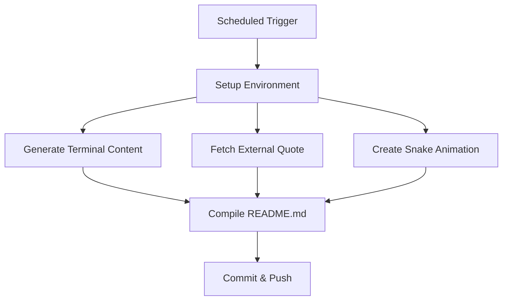

# Technical Documentation

## Architecture Overview

### System Design Pattern
This repository implements a **Content Generation Pipeline** pattern with the following components:

```
[GitHub Actions Trigger] → [Environment Setup] → [Content Generators] → [Asset Compilation] → [Deployment]
```

### Data Flow Architecture



## Core Components Deep Dive

### 1. Terminal Simulation Engine (`update-terminal.sh`)

**Design Pattern**: Template Method Pattern

```bash
# Load average generation algorithm
generate_load_avg() {
    if ! command -v bc &> /dev/null; then
        echo "0.50 0.60 0.40"  # Fallback values
        return
    fi
    printf "%.2f %.2f %.2f" \
        "$(echo "scale=2; ${RANDOM}/32767 + 0.1" | bc)" \
        "$(echo "scale=2; ${RANDOM}/32767 + 0.2" | bc)" \
        "$(echo "scale=2; ${RANDOM}/32767 + 0.1" | bc)"
}
```

**Key Features**:
- Dynamic timestamp generation using `date -u +"%Y-%m-%d %T"`
- Pseudo-random load averages using BASH `$RANDOM`
- Template-based content generation with HERE documents
- Error handling with fallback values

### 2. SVG Animation System

#### Header Generator (`generate-header.js`)
**Animation Type**: CSS-based radial gradient cycling

```javascript
const animationPattern = {
  duration: "6s",
  repeatCount: "indefinite",
  colorStops: {
    inner: "#00f → #0ff → #00f",
    outer: "#f0f → #ff0 → #f0f"
  }
};
```

#### Quote Display (`fetch-quote.js`)
**Animation Types**:
1. **Typewriter Effect**: Character-by-character reveal
2. **Blinking Cursor**: CSS animation with opacity cycling

```css
@keyframes typing {
  from { width: 0 }
  to { width: ${cleanQuote.length}ch; }
}

@keyframes blink {
  0%, 49% { opacity: 1; }
  50%, 100% { opacity: 0; }
}
```

### 3. GitHub Actions Orchestration

#### Workflow Execution Order
1. **Environment Preparation**
   - Ubuntu runner initialization
   - System package installation (figlet, lolcat, etc.)
   - Node.js environment setup

2. **Dependency Installation**
   ```yaml
   - name: Install system dependencies
     run: |
       sudo apt-get update && sudo apt-get install -y \
         figlet lolcat neofetch boxes cowsay fortune bc
   ```

3. **Content Generation Phase**
   - Snake graph generation (Platane/snk@v3)
   - Terminal content creation
   - Quote fetching and SVG generation

4. **Deployment Phase**
   - Git configuration
   - Selective file staging
   - Atomic commit and push

## Technical Specifications

### Unicode Character System
The repository uses **Mathematical Alphanumeric Symbols** and **Sutton SignWriting** Unicode blocks:

- `𖢧ꛅ𖤢ꚽꚳꛈ𖢧ꛕꛅ` - Primary username display
- `ꚽꛈ𖢧ꛅꚶꔪ` - Statistics header
- `𖦪𖤢ꛎꚳ𖢑` - Repository descriptor

**Encoding**: UTF-8 with proper HTML entity escaping

### Performance Characteristics

#### File Size Analysis
```
README.md:        ~11KB (dynamic content)
Snake SVG:        ~26KB (contribution graph)
Header SVG:       ~1KB (animated header)
Quote SVG:        ~1.5KB (typewriter animation)
```

#### Runtime Performance
- **Cold start**: ~45-60 seconds (full environment setup)
- **Content generation**: ~5-10 seconds
- **Asset compilation**: ~15-20 seconds
- **Git operations**: ~5-10 seconds

#### Caching Strategy
**Current Implementation**: No caching (regenerates all content)
**Cache Opportunities**:
- Quote API responses (24h TTL)
- Load average calculations (1h TTL)
- External service responses

### API Integration Points

#### External Dependencies
1. **ZenQuotes API**
   - Endpoint: `https://zenquotes.io/api/random`
   - Rate Limit: Unspecified
   - Fallback: None (causes failure)

2. **GitHub Stats APIs**
   - `github-readme-stats.vercel.app`
   - `github-readme-streak-stats.herokuapp.com`

3. **Shield Badge Service**
   - `img.shields.io` for technology badges
   - `komarev.com/ghpvc` for profile view counter

### Error Handling Patterns

#### Graceful Degradation
```bash
# Example from load average generation
if ! command -v bc &> /dev/null; then
    echo "0.50 0.60 0.40"  # Static fallback
    return
fi
```

#### Network Error Handling
```javascript
https.get(endpoint, (res) => {
  // Success handler
}).on('error', (err) => {
  console.error('❌ HTTPS error:', err.message);
  process.exit(1);  // Hard failure - no graceful degradation
});
```

**Issue**: Network failures cause complete workflow failure

### Security Architecture

#### Permission Model
```yaml
permissions:
  contents: write  # Required for README updates
```

**Security Concerns**:
- Broad write permissions
- No secret management
- Disabled TLS verification

#### Input Validation
```javascript
// Quote sanitization
const cleanQuote = quoteText
  .replace(/&/g, "&amp;")
  .replace(/</g, "&lt;")
  .replace(/>/g, "&gt;");
```

## Development Environment Setup

### Local Development
```bash
# Install dependencies
npm install

# Generate header
node scripts/generate-header.js

# Fetch quote (requires internet)
node scripts/fetch-quote.js

# Update terminal (full pipeline)
./scripts/update-terminal.sh
```

### Environment Variables
```bash
USERNAME="Custom Display Name"
GITHUB_USER="github-username"
CURRENT_TIME="2025-08-03 15:30:00"
```

### Testing Individual Components
```bash
# Test load average generation
bash -c 'source scripts/update-terminal.sh; generate_load_avg'

# Test quote fetching
node scripts/fetch-quote.js

# Test header generation
node scripts/generate-header.js
```

## Extension Points

### Adding New Content Generators
1. Create new script in `/scripts/` directory
2. Add execution call in `update-terminal.sh`
3. Update GitHub Actions workflow if needed

### Custom SVG Animations
```javascript
// Template for new SVG generator
const fs = require('fs');

const generateCustomSVG = (data) => {
  const svg = `
    <svg viewBox="0 0 800 200" xmlns="http://www.w3.org/2000/svg">
      <!-- Custom content here -->
    </svg>
  `;
  return svg;
};

fs.writeFileSync('dist/custom.svg', generateCustomSVG(data));
```

### Configuration Management
```javascript
// Proposed config system
const config = {
  animations: {
    speed: process.env.ANIMATION_SPEED || 'normal',
    theme: process.env.THEME || 'hacker-green'
  },
  content: {
    showStats: process.env.SHOW_STATS !== 'false',
    quoteSource: process.env.QUOTE_SOURCE || 'zenquotes'
  }
};
```

## Monitoring and Debugging

### Workflow Debugging
```yaml
- name: Debug Environment
  run: |
    echo "Node version: $(node --version)"
    echo "NPM version: $(npm --version)"
    echo "Available commands: $(which figlet lolcat bc)"
```

### Log Analysis
- GitHub Actions logs provide execution timeline
- Script outputs use emoji prefixes for categorization
- Error messages include context for debugging

### Performance Monitoring
```bash
# Add timing to scripts
start_time=$(date +%s)
# ... script execution ...
end_time=$(date +%s)
echo "⏱️ Execution time: $((end_time - start_time))s"
```

---

This technical documentation provides the foundation for understanding, maintaining, and extending the repository's functionality.